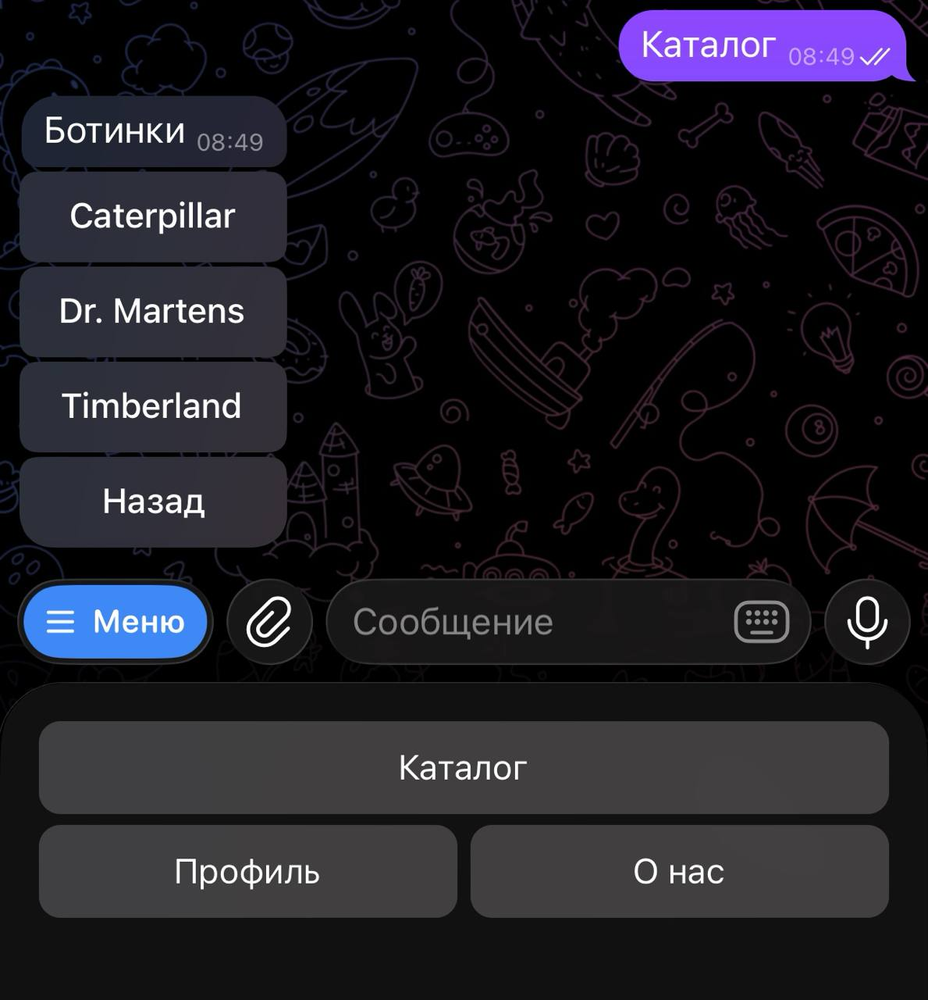
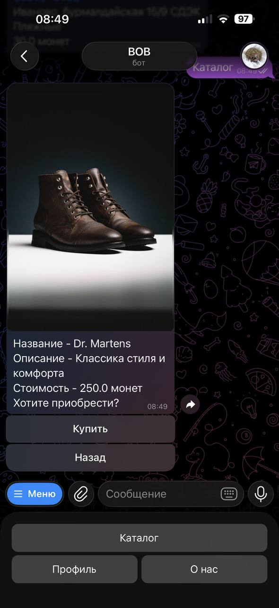
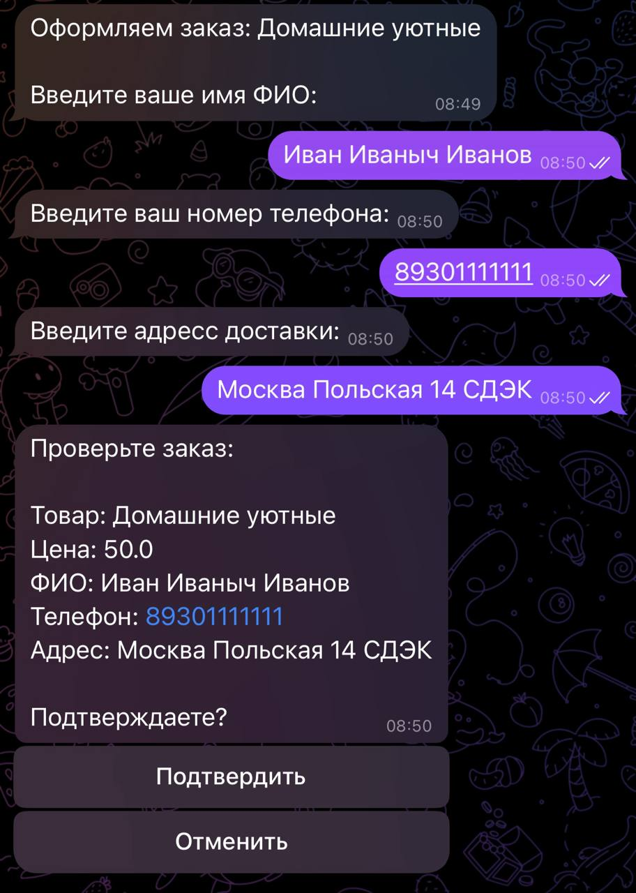
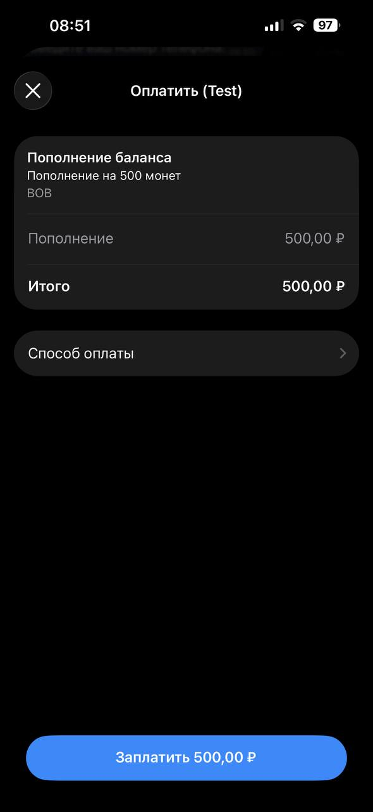
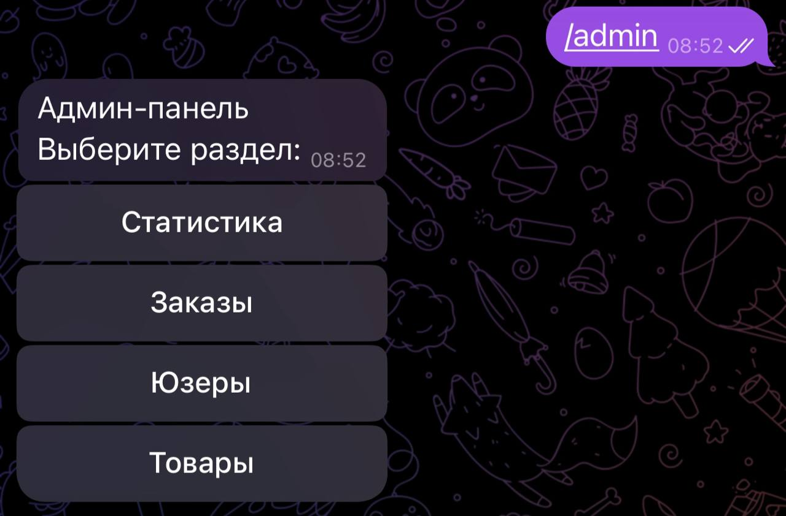
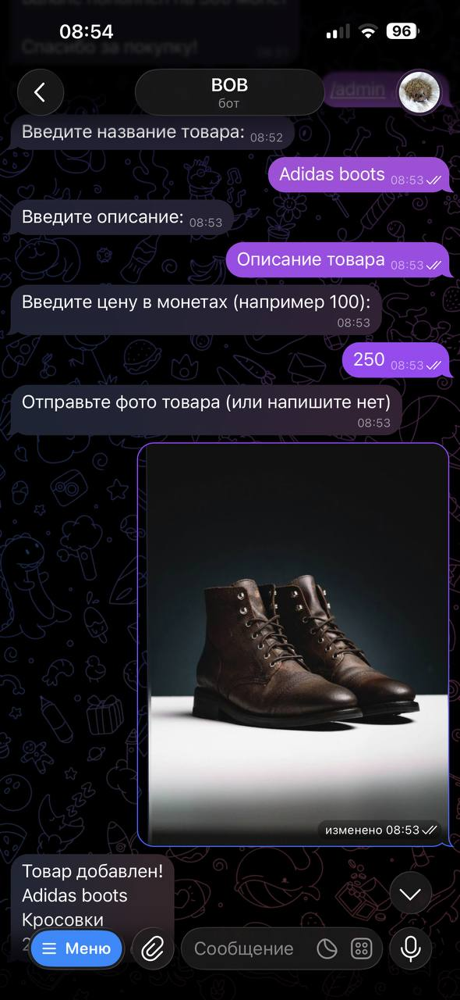
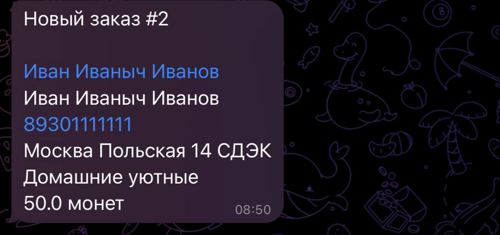

# 🛍 TELEGRAM SHOP BOT — ГОТОВЫЙ МАГАЗИН В TELEGRAM

---

## 🤖 ДЕМО-БОТ — ПОТЫКАЙ ПРЯМО СЕЙЧАС

**[@BOB12332_bot](https://t.me/BOB12332_bot)**

- `/start` — начать
- **Каталог** → **Ботинки** → **Dr. Martens**
- **Профиль** → **Пополнить** → **100 монет** (**тестовая** **карта**: `4111 1111 1111 1111`, **CVC** `123`)

---

> **Бот, который ПРОДАЁТ за вас 24/7.** Каталог, приём заказов, оплата через Telegram Payments, уведомления, админ-панель. **Разверните за 5 минут — начните продавать СЕГОДНЯ.**

[](https://python.org)
[](https://docs.aiogram.dev)
[](https://sqlalchemy.org)
[](https://yookassa.ru)
[](https://opensource.org/licenses/MIT)

---

## 💥 ПОЧЕМУ ЭТОТ БОТ

### 😱 Проблема

**Вы теряете заказы, потому что:**
- ❌ Менеджер **не отвечает ночью** — клиент ушёл к конкурентам
- ❌ Заказы **теряются** в личке Telegram — хаос
- ❌ Клиент **не знает**, какие товары есть — надо каждый раз отвечать
- ❌ **Нет статистики** — непонятно, что продаётся

### ✅ Решение — этот бот

- ✅ **Принимает заказы 24/7** — даже когда вы спите
- ✅ **Каталог с фото** — клиент сам выбирает
- ✅ **Оплата картой** через Telegram Payments — **деньги сразу на счёт**
- ✅ **Уведомления с ссылкой на клиента** — пишите ему в 1 клик
- ✅ **Админ-панель** — статистика, заказы, товары — всё под контролем

**Итог:** клиент **оформляет заказ за 1 минуту** — вы **получаете оплату** и **уведомление**.

---

## 🚀 ЧТО УМЕЕТ БОТ

### 👤 Для клиента

- 📦 **Каталог** с категориями и фото товаров
- 🛒 **Оформление заказа**: ФИО → телефон → адрес доставки
- 💳 **ОПЛАТА ПРЯМО В БОТЕ** — картой, через **Telegram Payments (ЮKassa)**
- 👤 **Личный профиль** с балансом
- 📋 **История заказов** с датами и суммами
- 🎯 **Удобный интерфейс** — inline-кнопки, пошаговые диалоги

### 🔧 Для администратора

- 📊 **Статистика в реальном времени** — юзеры, заказы, выручка
- 📦 **Все заказы** — ФИО, телефон, адрес, товары, суммы
- 👥 **База клиентов** — имена, username, баланс
- 🛍 **Управление товарами прямо в боте:**
  - ➕ **Добавить товар** за 30 секунд (имя → описание → цена → фото)
  - 🗑 **Удалить** неактуальный товар
- 🔔 **Мгновенные уведомления** о новых заказах **со ссылкой на клиента** — пишите прямо из уведомления
- 🔐 **Защита** — панель доступна только вашему ADMIN_ID

### 🛠 Технические фишки

- ⚡ **Асинхронность** — aiogram 3.x + aiosqlite (**быстро, надёжно**)
- 🗄 **SQLAlchemy 2.0** — современный ORM с типами
- 🏗 **Чистая архитектура** — handlers / repositories / models
- 🔄 **Middleware** для сессии БД — **одна сессия на запрос**
- ✅ **Валидация** баланса перед покупкой
- 🎨 **CallbackData фабрики** — типобезопасные кнопки
- 📸 **Поддержка фото** — через `file_id` Telegram (**мгновенная загрузка**)
- 🛡 **Защита от падений** — `try/except TelegramBadRequest` везде, где нужно

---

## 💰 СКОЛЬКО ЭТО СТОИТ

| Что | Цена |
|-----|------|
| **Базовая версия** (адаптация под ваш бизнес) | **от 25 000 ₽** |
| **С корзиной и промокодами** | **от 40 000 ₽** |
| **Развёртывание на VPS** | **+5 000 ₽** |
| **Сопровождение 1 месяц** | **+5 000 – 10 000 ₽** |
| **Хостинг (VPS)** | **~200 ₽/мес** (**оплачиваете вы**) |
| **Комиссия ЮKassa** | **~3%** |
| **Настройка хостинга** (VPS + systemd) | **+5 000 ₽** (**или** **настрою** **сам** **—** **вы** **оплачиваете** **только** **VPS**) |

**Окупается с первых заказов.**

---

## 🛠 СТЕК ТЕХНОЛОГИЙ

| Технология | Версия | Назначение |
|------------|--------|------------|
| **Python** | 3.12+ | Язык |
| **aiogram** | 3.x | Telegram Bot API |
| **SQLAlchemy** | 2.0 | ORM |
| **aiosqlite** | 0.20+ | Async SQLite |
| **python-dotenv** | 1.0+ | Загрузка `.env` |
| **ЮKassa** | TEST/Live | Приём платежей |

---

## 📁 СТРУКТУРА ПРОЕКТА

```
Tg/
├── Handlers/              # Обработчики (роутеры)
│   ├── start.py          # /start
│   ├── info.py           # "О нас"
│   ├── Catalog.py        # Каталог
│   ├── order.py          # Оформление заказа (FSM)
│   ├── payment.py        # ОПЛАТА (Telegram Payments)
│   ├── profile.py        # Профиль, история заказов
│   └── admin.py          # Админ-панель + CRUD товаров
│
├── database/              # Работа с БД
│   ├── models/           # SQLAlchemy модели
│   │   ├── user.py
│   │   ├── category.py
│   │   ├── item.py
│   │   └── order.py
│   └── __init__.py       # Экспорт моделей
│
├── repositories/          # CRUD-репозитории
│   ├── user.py
│   ├── categories.py
│   ├── item.py
│   └── order.py
│
├── keyboards/             # Inline / Reply клавиатуры
│   ├── menu.py
│   ├── catalog.py
│   ├── profile.py
│   └── admin.py
│
├── filters/               # Кастомные фильтры
│   ├── is_admin.py       # Проверка админа
│   └── check_buy_item.py # Проверка баланса
│
├── middlewares/           # Middleware
│   └── session.py        # Сессия БД в data
│
├── states/                # FSM-состояния
│   ├── admin.py
│   ├── order.py
│   └── profile.py
│
├── utils/                 # Утилиты
│   └── notify.py         # Уведомления админу
│
├── main.py                # Точка входа
├── .env                   # Токены (не в Git!)
├── .gitignore
└── requirements.txt
```

---

## ⚙️ БЫСТРЫЙ СТАРТ — 5 МИНУТ

### 1. Клонируй репозиторий

```bash
git clone https://github.com/Sisyapisa/tg-shop-bot.git
cd tg-shop-bot
```

### 2. Создай виртуальное окружение

```bash
python -m venv venv

# Windows:
venv\Scripts\activate

# Linux / Mac:
source venv/bin/activate
```

### 3. Установи зависимости

```bash
pip install -r requirements.txt
```

### 4. Создай `.env`

```env
BOT_TOKEN=твой_токен_от_BotFather
ADMIN_ID=твой_telegram_id
PROVIDER_TOKEN=токен_от_BotFather_для_оплаты
```

**Где взять:**
- `BOT_TOKEN` — [@BotFather](https://t.me/BotFather) → `/newbot`
- `ADMIN_ID` — [@userinfobot](https://t.me/userinfobot)
- `PROVIDER_TOKEN` — [@BotFather](https://t.me/BotFather) → **Payments** → **ЮKassa (TEST)** → **Get provider token**

### 5. Запусти

```bash
python main.py
```

**Готово! Бот работает.** Заходите в Telegram → `/start` → `/admin` → добавляйте товары.

---

## 📸 СКРИНШОТЫ

### 📦 Каталог и товары

| Каталог категорий | Карточка товара с фото |
|-------------------|------------------------|
|  |  |

### 🛒 Оформление заказа и оплата

| Оформление заказа | Оплата через Telegram |
|-------------------|------------------------|
|  |  |

### 🔧 Админ-панель

| Главное меню админа | Добавление товара |
|---------------------|-------------------|
|  |  |

### 🔔 Уведомления

| Уведомление о новом заказе |
|----------------------------|
|  |

---

## 💼 КОМУ ПОДХОДИТ

- 🛍 **Интернет-магазины** в Telegram
- 👟 **Магазины одежды / обуви / аксессуаров**
- 💎 **Ювелирные украшения** (браслеты, кольца)
- 🎁 **Продажа цифровых товаров**
- 🍕 **Доставка еды**
- 📚 **Продажа курсов / книг**
- 🏪 **Любой бизнес**, где есть каталог + заказы

**Легко адаптируется**: меняешь категории и товары через админку — бот готов.

---

## 🚀 ЭТАПЫ РАБОТЫ

1. **Заявка** в Telegram → обсуждение задачи (**30 минут**)
2. **Предоплата 50–70%** → старт работы
3. **Адаптация бота** под ваш бизнес (**1–2 дня**)
4. **Демонстрация** и правки
5. **Сдача** + развёртывание на вашем сервере
6. **Сопровождение 1 месяц** (по желанию)

**Никаких скрытых платежей. Всё прозрачно.**
---

## ✅ ЧТО УЖЕ ГОТОВО

- ✅ **Каталог** с категориями и фото товаров
- ✅ **Оформление заказа**: ФИО → телефон → адрес доставки → подтверждение
- ✅ **Оплата** через **Telegram Payments (ЮKassa)** — принимает карты **прямо в боте**
- ✅ **Админ-панель** — статистика, заказы, база клиентов
- ✅ **CRUD товаров** прямо в боте — добавление, удаление
- ✅ **Уведомления** со **ссылкой** на клиента — пишите в 1 клик
- ✅ **Профиль** юзера с балансом и историей заказов
- ✅ **Развёртывание** на VPS с **systemd** (автозапуск 24/7)

---

## 🎯 ЧТО МОЖНО ДОБАВИТЬ (по запросу)

- [ ] **Корзина** — несколько товаров в заказе
- [ ] **Пагинация** в заказах и юзерах
- [ ] **Промокоды** и скидки
- [ ] **Редактирование** товаров через админку
- [ ] **Webhook** вместо polling
- [ ] **PostgreSQL** вместо SQLite (для высокой нагрузки)
- [ ] **Email-уведомления**
- [ ] **Интеграция со СДЭК / Boxberry**

**Цены** **на** **доработки:**
- **Корзина** — **от 5 000 ₽**
- **Промокоды** — **от 7 000 ₽**
- **Пагинация** — **от 3 000 ₽**
- **Email-уведомления** — **от 4 000 ₽**
- **Интеграция СДЭК** — **от 10 000 ₽**

**Срок** — **1-3 дня** на фичу.

---

## 📞 НУЖЕН БОТ?

**Пиши в Telegram — обсудим за 5 минут:**

📱 **[@pipapupapipu](https://t.me/pipapupapipu)**

**Что могу:**
- 🎯 **Адаптировать** этот бот под ваш бизнес
- 🆕 **Разработать** нового бота с нуля
- 🚀 **Развернуть** на вашем сервере за 1 день
- 🛠 **Сопровождение** **1 месяц** после сдачи (**по** **желанию**)

**Цена — от 25 000 ₽**, зависит от объёма адаптации. Работаю **быстро**, **с гарантией**, **с примерами** (этот репо — портфолио).
---

## 📄 ЛИЦЕНЗИЯ

**Проприетарная лицензия.**

- **Покупая бота, вы получаете право использовать его для своего бизнеса** (один проект).
- **Перепродажа кода** или **передача третьим лицам** запрещена.
- **Коммерческое использование** — только с **разрешения автора**.
---

⭐ **Понравился проект? Поставь звезду — это мотивирует!**

**👇 ПИШИ ПРЯМО СЕЙЧАС: [@pipapupapipu](https://t.me/pipapupapipu)**