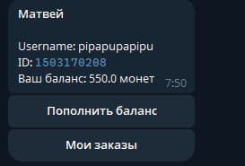

# 🛍 Telegram Shop Bot

> Полноценный Telegram-бот магазина с каталогом, оформлением заказов, оплатой через Telegram Payments и админ-панелью. Готов к запуску и продаже.

[](https://python.org)
[](https://docs.aiogram.dev)
[](https://sqlalchemy.org)
[](https://opensource.org/licenses/MIT)

---

## 🚀 Возможности

### 👤 Для пользователя

- 📦 **Каталог** с категориями и товарами (из базы данных)
- 🛒 **Оформление заказа**: ФИО → телефон → адрес доставки → подтверждение
- 💳 **Пополнение баланса** через Telegram Payments (ЮKassa)
- 👤 **Профиль** с балансом и ID
- 📋 **История заказов** — все покупки с датами, суммами и статусами
- 🎯 **Удобный интерфейс** — inline-кнопки, FSM-диалоги

### 🔧 Для администратора

- 📊 **Статистика** — юзеры, заказы, общая сумма
- 📦 **Все заказы** — последние 10 с деталями (ФИО, телефон, адрес)
- 👥 **Список юзеров** — имена, username, баланс
- 🛍 **CRUD товаров**:
  - ➕ Добавить товар (имя → описание → цена → категория → фото)
  - 🗑 Удалить товар
- 🔔 **Уведомления** о новых заказах с ссылкой на юзера (`tg://user?id=...`)
- 🔐 **Защита** — админ-панель только для ADMIN_ID

### 🛠 Технические фишки

- ⚡ **Асинхронность** — aiogram 3.x + aiosqlite
- 🗄 **SQLAlchemy 2.0** — современный ORM с типами
- 🏗 **Чистая архитектура** — handlers / repositories / models
- 🔄 **Middleware** для сессии БД — одна сессия на запрос
- ✅ **Валидация** баланса перед покупкой
- 🎨 **CallbackData фабрики** — типобезопасные кнопки
- 📸 **Поддержка фото** — через `file_id` Telegram

---

## 🛠 Стек технологий

| Технология | Версия | Назначение |
|------------|--------|------------|
| **Python** | 3.12+ | Язык |
| **aiogram** | 3.x | Telegram Bot API |
| **SQLAlchemy** | 2.0 | ORM |
| **aiosqlite** | 0.20+ | Async SQLite |
| **python-dotenv** | 1.0+ | Загрузка `.env` |

---

## 📁 Структура проекта

```
Tg/
├── Handlers/              # Обработчики (роутеры)
│   ├── start.py          # /start
│   ├── info.py           # "О нас"
│   ├── Catalog.py        # Каталог
│   ├── order.py          # Оформление заказа (FSM)
│   ├── payment.py        # Оплата (Telegram Payments)
│   ├── profile.py        # Профиль, история заказов
│   └── admin.py          # Админ-панель + CRUD товаров
│
├── database/              # Работа с БД
│   ├── models/           # SQLAlchemy модели
│   │   ├── user.py
│   │   ├── category.py
│   │   ├── item.py
│   │   └── order.py
│   └── __init__.py       # Экспорт моделей
│
├── repositories/          # CRUD-репозитории
│   ├── user.py
│   ├── categories.py
│   ├── item.py
│   └── order.py
│
├── keyboards/             # Inline / Reply клавиатуры
│   ├── menu.py
│   ├── catalog.py
│   ├── profile.py
│   └── admin.py
│
├── filters/               # Кастомные фильтры
│   ├── is_admin.py       # Проверка админа
│   └── check_buy_item.py # Проверка баланса
│
├── middlewares/           # Middleware
│   └── session.py        # Сессия БД в data
│
├── states/                # FSM-состояния
│   ├── admin.py          # Добавление/удаление товаров
│   ├── order.py          # Оформление заказа
│   └── profile.py        # Пополнение баланса
│
├── utils/                 # Утилиты
│   └── notify.py         # Уведомления админу
│
├── main.py                # Точка входа
├── .env                   # Токены (не в Git!)
├── .gitignore
└── requirements.txt
```

---

## ⚙️ Быстрый старт

### 1. Клонируй репозиторий

```bash
git clone https://github.com/Sisyapisa/tg-shop-bot.git
cd tg-shop-bot
```

### 2. Создай виртуальное окружение

```bash
python -m venv venv

# Windows:
venv\Scripts\activate

# Linux / Mac:
source venv/bin/activate
```

### 3. Установи зависимости

```bash
pip install -r requirements.txt
```

### 4. Создай `.env`

```env
BOT_TOKEN=твой_токен_от_BotFather
ADMIN_ID=твой_telegram_id
PROVIDER_TOKEN=токен_от_BotFather_для_оплаты
```

**Где взять:**
- `BOT_TOKEN` — [@BotFather](https://t.me/BotFather) → `/newbot`
- `ADMIN_ID` — [@userinfobot](https://t.me/userinfobot)
- `PROVIDER_TOKEN` — [@BotFather](https://t.me/BotFather) → **Payments** → **ЮKassa (TEST)**

### 5. Запусти

```bash
python main.py
```

---

## 📸 Скриншоты

| Каталог | Карточка товара |
|---------|-----------------|
|  |  |

| Профиль | Админ-панель |
|---------|--------------|
|  |  |

---

## 💼 Для чего подходит

Этот бот — **готовое решение** для:

- 🛍 **Интернет-магазинов** в Telegram
- 👟 **Магазинов одежды / обуви**
- 🎁 **Продажи цифровых товаров**
- 🍕 **Доставки еды**
- 📚 **Продажи курсов / книг**

**Легко адаптируется** под любой бизнес: меняешь категории и товары в админке — и бот готов.

---

## 🎯 Что можно добавить

- [ ] **Корзина** — несколько товаров в заказе
- [ ] **Пагинация** в заказах и юзерах
- [ ] **Промокоды** и скидки
- [ ] **Редактирование** товаров через админку
- [ ] **Webhook** вместо polling
- [ ] **PostgreSQL** вместо SQLite (для нагрузки)

---

## 👨‍💻 Автор

**Матвей** — Python-разработчик Telegram-ботов

- 📱 Telegram: [@pipapupapipu](https://t.me/pipapupapipu)
- 💻 GitHub: [@Sisyapisa](https://github.com/Sisyapisa)

**Нужен бот?** Пиши в Telegram — обсудим!

---

## 📄 Лицензия

MIT — используй **свободно**, в том числе **в коммерческих целях**.

---

⭐ **Понравился проект?** Поставь звезду на GitHub!